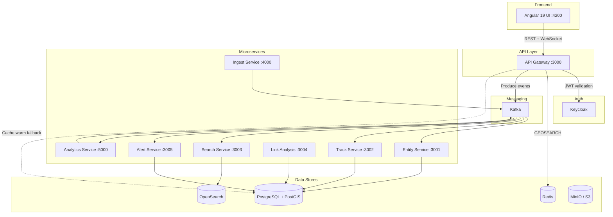
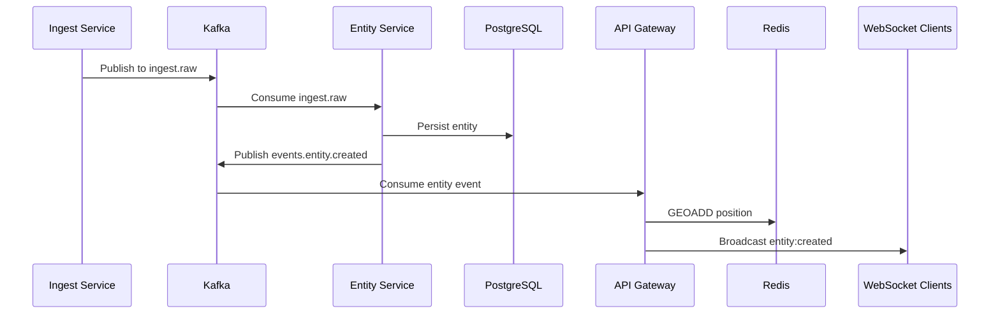
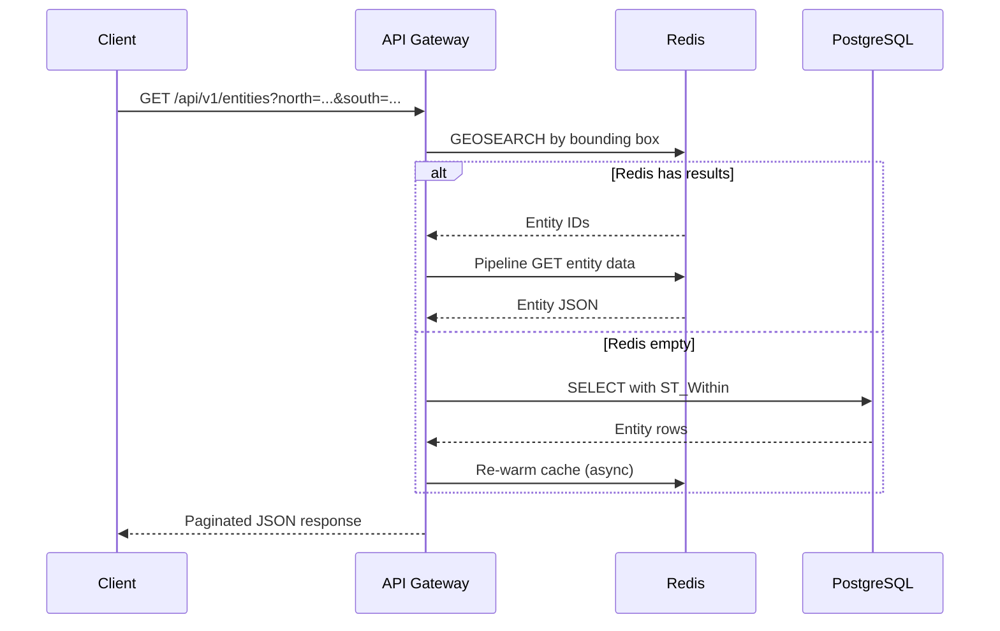

# Architecture

## Overview

SENTINEL is a geospatial intelligence platform built as a polyglot microservices system. It tracks entities (vessels, aircraft, vehicles, persons, facilities) in real-time, provides link analysis between entities, and generates alerts based on configurable rules.

## System Architecture

## Data Flow

### Entity Ingestion

### Entity Query (REST)

## Communication Patterns

### Synchronous

- **REST API**: Client-to-Gateway communication for CRUD operations and queries
- **WebSocket (Socket.io)**: Real-time entity position updates and alert notifications via the `/entities` namespace
- **gRPC** (planned): Inter-service communication for low-latency request-reply

### Asynchronous

- **Kafka event streaming**: All entity state changes flow through Kafka topics. Services consume relevant topics and maintain their own read models:
  - `events.entity.*` — Entity lifecycle events (created, updated, deleted, position)
  - `events.track.point` — Track point events for historical replay
  - `alerts.*` — Geofence breach and anomaly alerts
  - `analytics.pattern` — Pattern analysis results
  - `ingest.raw` — Raw data from external feeds

### Caching Strategy

- **Redis GEOSEARCH**: Entity positions stored as a geospatial sorted set (`sentinel:entities:geo`). Bounding-box queries use `GEOSEARCH FROMLONLAT BYBOX` for sub-millisecond spatial lookups.
- **Redis JSON cache**: Full entity data cached at `sentinel:entities:cache:{id}` with a 300-second TTL.
- **Cache warming**: On API Gateway startup, all entities are loaded from PostgreSQL into Redis. If Redis returns empty results at query time, a direct PostgreSQL fallback is used and the cache is re-warmed.

## Service Responsibilities

| Service | Language | Port | Role |
|---------|----------|------|------|
| **API Gateway** | TypeScript/NestJS | 3000 | REST API, WebSocket gateway, auth, Redis cache orchestration |
| **Entity Service** | TypeScript/NestJS | 3001 | Entity CRUD, PostgreSQL persistence, domain events |
| **Track Service** | TypeScript/NestJS | 3002 | Track point storage in TimescaleDB hypertable, historical replay |
| **Search Service** | TypeScript/NestJS | 3003 | Full-text and geospatial search via OpenSearch |
| **Link Analysis Service** | TypeScript/NestJS | 3004 | Entity relationship graph, link scoring |
| **Alert Service** | TypeScript/NestJS | 3005 | Geofence breach detection, anomaly alerting, rule engine |
| **Ingest Service** | Go | 4000 | High-throughput data ingestion from external feeds |
| **Analytics Service** | Python | 5000 | Pattern detection, ML-based anomaly analysis |
| **Web UI** | TypeScript/Angular | 4200 | CesiumJS 3D map, entity management, alerts dashboard |

## Authentication & Authorization

- **Keycloak** provides OIDC/JWT authentication
- **JwtAuthGuard** validates tokens against Keycloak's JWKS endpoint
- **Role-based access**: `@Roles('analyst', 'admin')` decorator requires at least one matching role
- **Classification-based access**: `@Classification('SECRET')` decorator enforces a hierarchical clearance check (UNCLASSIFIED < CONFIDENTIAL < SECRET < TOP_SECRET)
- **Dev mode**: When `NODE_ENV !== 'production'`, `JwtAuthGuard` short-circuits JWT validation and injects a synthetic user with full access (username: `dev-operator`, roles: `analyst, operator, admin`, clearance: `TOP_SECRET`)

## Shared Libraries

| Library | Path | Purpose |
|---------|------|---------|
| `@sentinel/shared-models` | `libs/shared-models/` | Entity, alert, link, track TypeScript interfaces and enums |
| `@sentinel/common` | `libs/common/` | Kafka topic constants, geo utilities (Haversine, bearing), Redis key prefixes, date formatting |
| `@sentinel/proto-gen` | `libs/proto-gen/` | Protobuf-generated types for cross-language communication |
